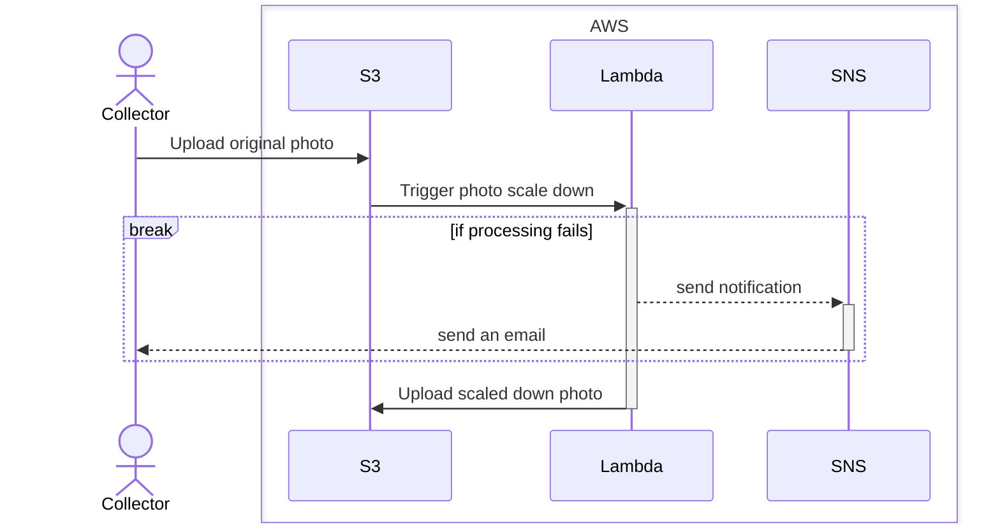

# Infrastructure

## Design

### Photo storage



## Toolset

* [`aws-vault`](https://github.com/99designs/aws-vault) (e.g. `brew install --cask aws-vault`)
* [`terraform`](https://developer.hashicorp.com/terraform/downloads) (e.g. `brew tap hashicorp/tap && brew install hashicorp/tap/terraform` or use [`asdf`](https://github.com/asdf-vm/asdf))
* [`terraform-docs`](https://terraform-docs.io/) (e.g. `brew install terraform-docs`)
* [`python`](https://www.python.org/) (version specified in the [`asdf`](https://github.com/asdf-vm/asdf)-friendly `.tool-versions`)

## AWS

### ClickOps

**Note:** estimated cost for ~1000 items in the collection is < 1$ per month.

1. You would need [an AWS account](https://aws.amazon.com/free/).
2. [Create an S3 Bucket](https://docs.aws.amazon.com/AmazonS3/latest/userguide/create-bucket-overview.html)
  * Name of the bucket needs to be unique for the region so you most likely won't be able to use `year-on-facade`
3. Add the following Bucket policy under Permissions:
```
{
    "Version": "2012-10-17",
    "Statement": [
        {
            "Effect": "Allow",
            "Principal": {
                "AWS": "arn:aws:iam::<your aws account id>:role/year-on-facade"
            },
            "Action": "s3:*",
            "Resource": "arn:aws:s3:::year-on-facade/terraform.tfstate"
        }
    ]
}
```
4. [Create an IAM User](https://docs.aws.amazon.com/IAM/latest/UserGuide/id_users_create.html#id_users_create_console)
  * Name - `year-on-facade`
  * `Attach policies directly` but don't attach any policies
5. [Create Access Key](https://docs.aws.amazon.com/IAM/latest/UserGuide/id_credentials_access-keys.html#Using_CreateAccessKey) for the `year-on-facade` user
  * You can save it locally or just use it in the next step
6. `aws-vault add year-on-facade` and enter access key id and secret
7. [Create an IAM role](https://docs.aws.amazon.com/IAM/latest/UserGuide/id_roles_create_for-user.html#roles-creatingrole-user-console)
  * AWS Account
  * This account
  * Role name - `year-on-facade`
  * Once role is created Create a JSON inline policy `year-on-facade` under Permissions for terraform to manage the required resources:
```json
{
    "Version": "2012-10-17",
    "Statement": [
        {
            "Effect": "Allow",
            "Action": "s3:*",
            "Resource": "arn:aws:s3:::year-on-facade"
        },
        {
            "Effect": "Allow",
            "Action": "lambda:*",
            "Resource": "arn:aws:lambda:*:*:function:year-on-facade-*"
        },
        {
            "Effect": "Allow",
            "Action": "logs:*",
            "Resource": "arn:aws:logs:*:*:log-group:/aws/lambda/year-on-facade-*"
        },
        {
            "Effect": "Allow",
            "Action": "logs:DescribeLogGroups",
            "Resource": "*"
        },
        {
            "Effect": "Allow",
            "Action": "sns:*",
            "Resource": "arn:aws:sns:*:*:year-on-facade"
        },
        {
            "Effect": "Allow",
            "Action": "iam:*",
            "Resource": [
                "arn:aws:iam::*:role/year-on-facade-*",
                "arn:aws:iam::*:policy/year-on-facade/*"
            ]
        }
    ]
}
```
  * Update `Principal.AWS` under Trust relationships to the ARN of `year-on-facade` IAM User
8. Update `config.properties` with information specific to your setup
9. Add the following to `~/.aws/config`
```
[profile year-on-facade]
[default]
region = <region you use, e.g. eu-west-2>
role_arn = <arn of the role you have created, e.g. "arn:aws:iam::000000000000:role/year-on-facade">
```
10. Run `make t-init`. You should be prompted for your system password and then see the message:
```
Terraform has been successfully initialized!
```
11. Run `make t-apply` to create the resources.
  * Note that you will be asked for an email address to send notifications to. You would get an email to Confirm subscription once it is created.

<!-- BEGIN_TF_DOCS_AWS -->
### Resources

| Name | Type |
|------|------|
| [aws_cloudwatch_log_group.resize](https://registry.terraform.io/providers/hashicorp/aws/latest/docs/resources/cloudwatch_log_group) | resource |
| [aws_iam_policy.lambda](https://registry.terraform.io/providers/hashicorp/aws/latest/docs/resources/iam_policy) | resource |
| [aws_iam_role.lambda](https://registry.terraform.io/providers/hashicorp/aws/latest/docs/resources/iam_role) | resource |
| [aws_iam_role_policy_attachment.lambda](https://registry.terraform.io/providers/hashicorp/aws/latest/docs/resources/iam_role_policy_attachment) | resource |
| [aws_lambda_function.resize](https://registry.terraform.io/providers/hashicorp/aws/latest/docs/resources/lambda_function) | resource |
| [aws_lambda_function_event_invoke_config.resize](https://registry.terraform.io/providers/hashicorp/aws/latest/docs/resources/lambda_function_event_invoke_config) | resource |
| [aws_lambda_permission.allow_bucket](https://registry.terraform.io/providers/hashicorp/aws/latest/docs/resources/lambda_permission) | resource |
| [aws_s3_bucket_notification.new_original_photo](https://registry.terraform.io/providers/hashicorp/aws/latest/docs/resources/s3_bucket_notification) | resource |
| [aws_s3_bucket_policy.this](https://registry.terraform.io/providers/hashicorp/aws/latest/docs/resources/s3_bucket_policy) | resource |
| [aws_s3_bucket_public_access_block.this](https://registry.terraform.io/providers/hashicorp/aws/latest/docs/resources/s3_bucket_public_access_block) | resource |
| [aws_s3_bucket_versioning.this](https://registry.terraform.io/providers/hashicorp/aws/latest/docs/resources/s3_bucket_versioning) | resource |
| [aws_sns_topic.dead_letter_queue](https://registry.terraform.io/providers/hashicorp/aws/latest/docs/resources/sns_topic) | resource |
| [aws_sns_topic_subscription.email](https://registry.terraform.io/providers/hashicorp/aws/latest/docs/resources/sns_topic_subscription) | resource |
| [terraform_data.install_pillow](https://registry.terraform.io/providers/hashicorp/terraform/latest/docs/resources/data) | resource |
<!-- END_TF_DOCS_AWS -->
